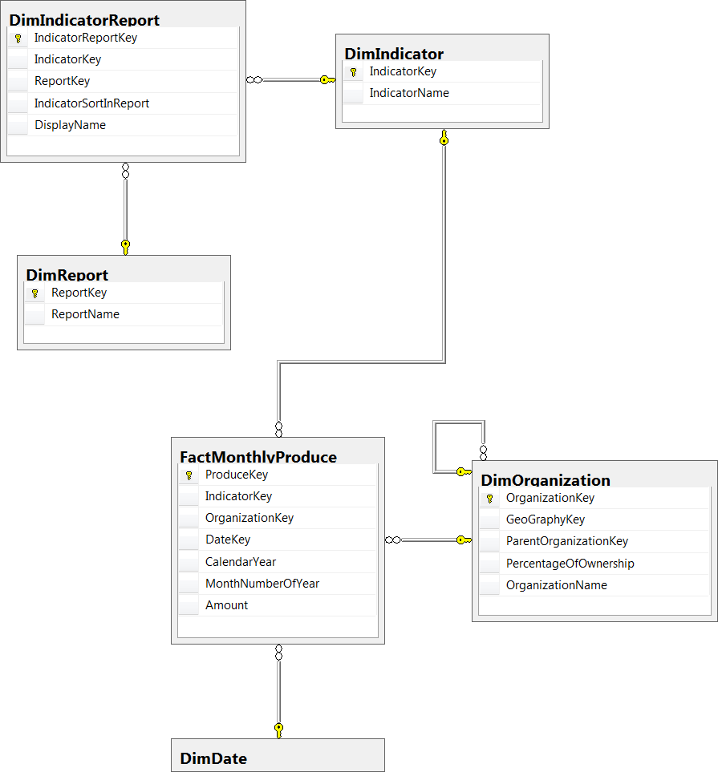
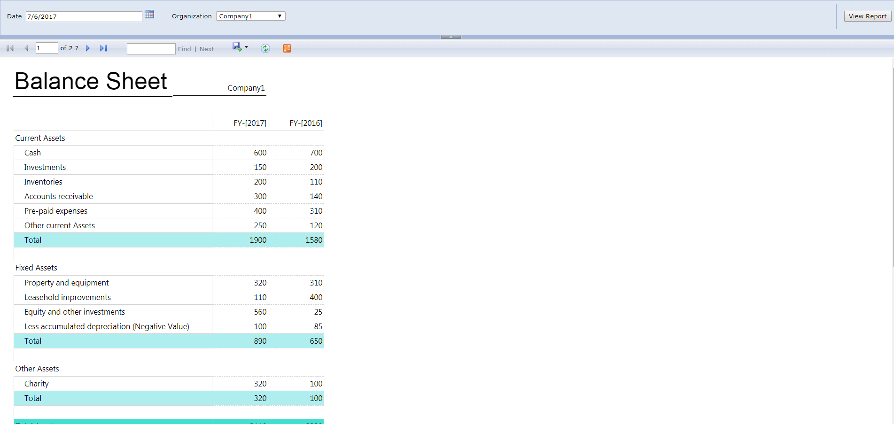
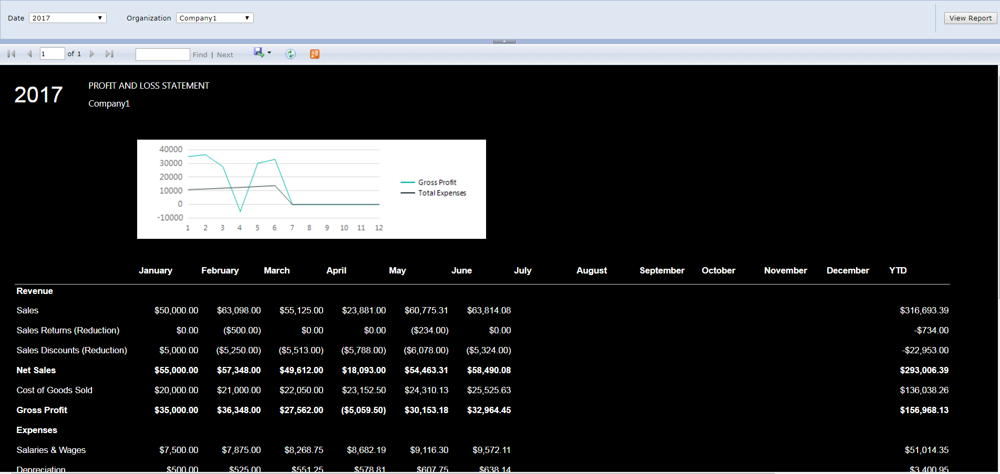

# Yummy-Rabbit App
## Description
This repository is the demo of a SSRS project based on my previous experience.
  
This demo shows that, when our customers have already got some standards(e.g. KPI codes),
how to store and make use of the data more efficiently when developing reports.

We fetch and store the data from our customers' transactional databases to our data warehouse, through ETL and mapping processs. 

Then we need to create several templates to visualize our reports. In this repository, I created the templates of balance sheet and P&L statement.

The last step is to maintain the indicators we need to display on the templates. We need to define what indicators we need to display, which row we want to put a specific indicator on and some other requirements (e.g bold, special color)

## Files
### SSRS Project Folder
```
./Tutorial
```

### Database script
```
./script.sql
```

## Screenshots

### Entity Relational Diagram


### Balance Sheet

### Profit and Loss


